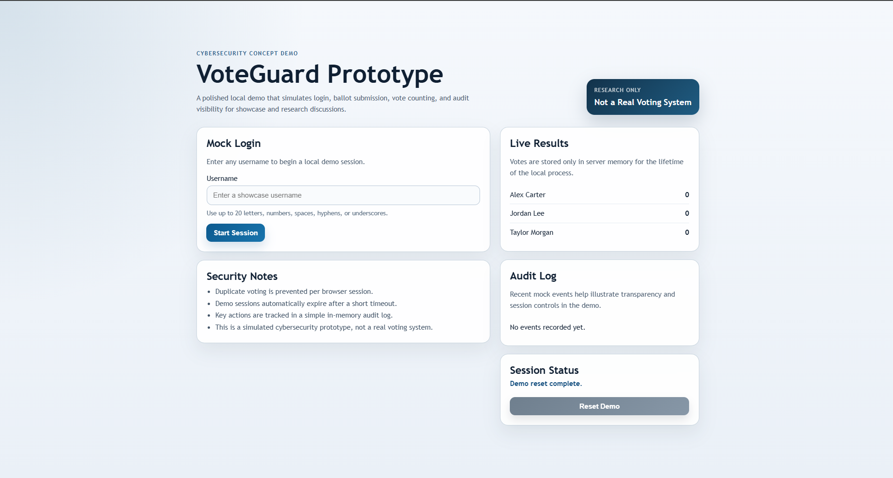
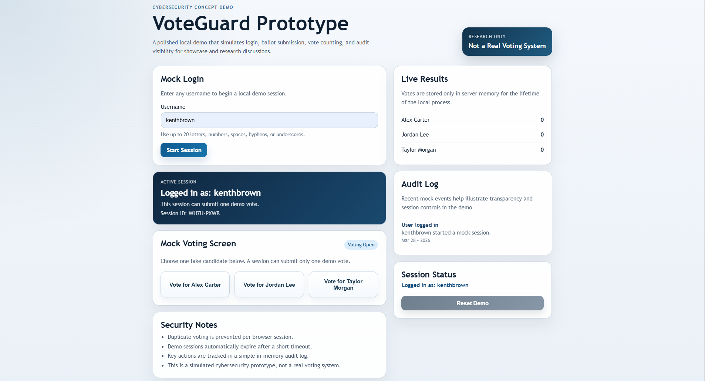
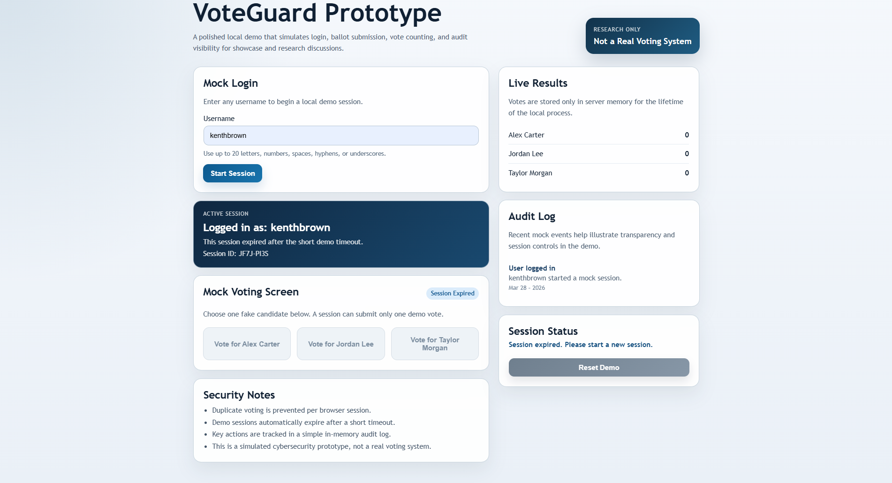
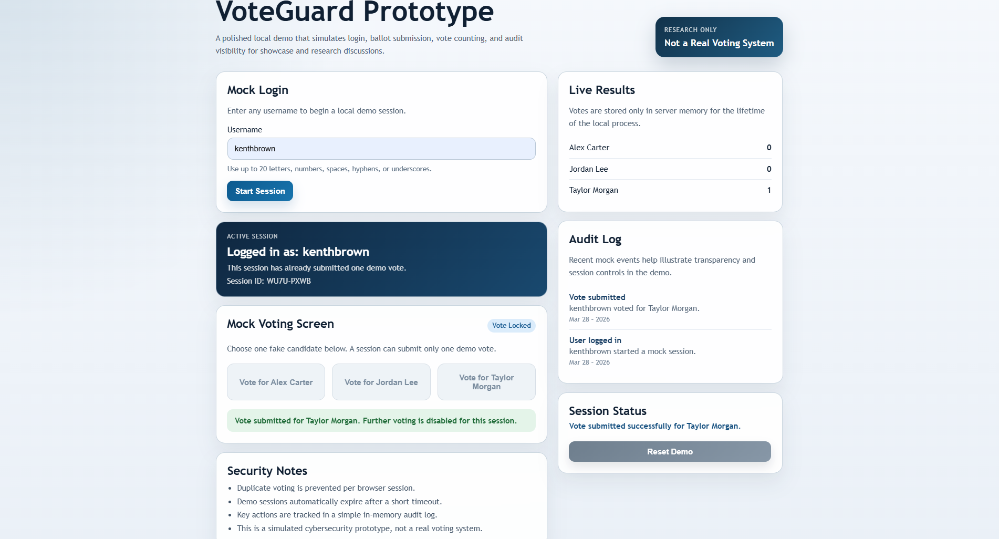

# VoteGuard Prototype

## Live Demo
👉 [Click here to try the app](https://voteguard-prototype.onrender.com)

VoteGuard Prototype is a small local web app that demonstrates a mock voting workflow for a cybersecurity project showcase. It lets a user log in with a username, cast one demo vote, view live in-memory results, and observe a simple audit trail of important actions.

## Important Notice

This is **not** a real voting system and must not be used to collect, record, tabulate, or certify actual votes.

No real security controls are implemented here. The goal is only to simulate behavior for research, demonstrations, and concept validation.

## Purpose

This app is designed to be easy to demo locally at `http://localhost:3000` while highlighting a few security-oriented concepts in a simple, visual way:

- mock user login
- single-session vote submission
- in-memory vote counting
- visible audit events for key actions

## Tech Stack

- Node.js
- Express
- Plain HTML
- Plain CSS
- Vanilla JavaScript

## Project Structure

- `docs/` - high-level project documentation
- `frontend/` - static HTML, CSS, and JavaScript for the demo interface
- `backend/` - Express server for mock login, voting, and results

## Key Features

- polished single-page frontend branded as `VoteGuard Prototype`
- mock login using username only
- visible vote buttons for 3 fake candidates
- one vote allowed per browser session
- in-memory vote storage
- audit log for login, vote submission, and duplicate vote blocking
- clear logged-in user display that stays visible during the session
- live results display and session status messaging

## Run Locally

1. Install Node.js 18+ if it is not already installed.
2. Open a terminal in `secure-voting-prototype`.
3. Run `npm install`.
4. Run `npm start`.
5. Open `http://localhost:3000` in a browser.

## Notes

- Votes are stored only in server memory.
- Restarting the server clears all results.
- Duplicate voting is prevented only at the demo session level.
- This implementation is intentionally simple and insecure because it is a cybersecurity demo, not a production system.
## Screenshots

### Login Screen

### Active Session

### Session Timeout

### Vote Submitted

